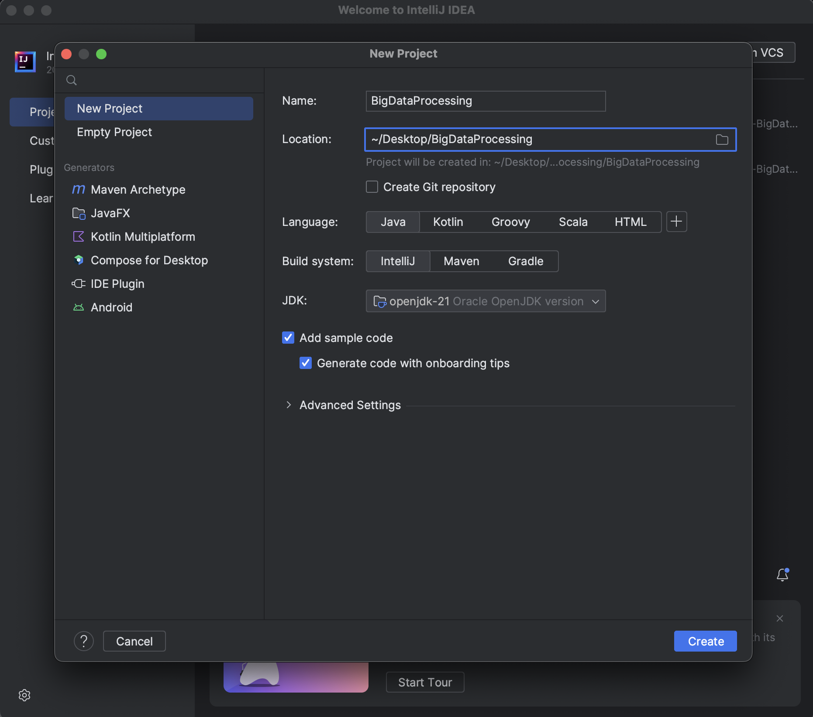
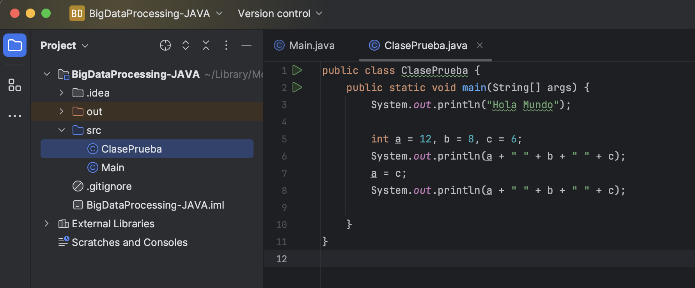
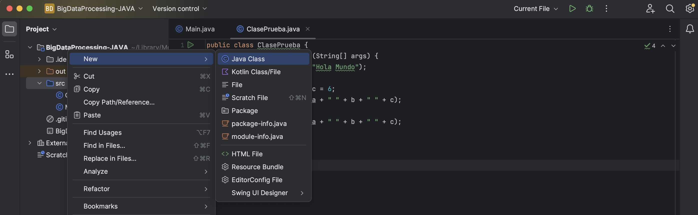

# Creación de un Proyecto Java en IntelliJ: El Punto de Entrada y Elementos Fundamentales

El entorno de desarrollo [IntelliJ](https://www.jetbrains.com/es-es/idea/) es una herramienta ampliamente utilizada por programadores Java debido a su versatilidad y capacidad de simplificar el proceso de desarrollo. En este apartado, exploraremos cómo crear un proyecto Java en IntelliJ y entenderemos los elementos fundamentales de una aplicación Java, incluyendo el método `main()`.

## Creación de un Proyecto Java en IntelliJ

1. **Instalación de IntelliJ**: En primer lugar, debes asegurarte de tener IntelliJ IDEA instalado en tu sistema. Si aún no lo has hecho, puedes [descargarlo](https://www.jetbrains.com/es-es/idea/download/) desde el sitio web oficial.

2. **Creación de un Proyecto**: Abre IntelliJ IDEA y selecciona "File" (Archivo) en la parte superior izquierda. Luego, elige "New" (Nuevo) y selecciona "Project" (Proyecto). Asegúrate de seleccionar "Java" en la lista de tecnologías disponibles.

3. **Configuración del Proyecto**: Deberás configurar el proyecto con un nombre y una ubicación. Asegúrate de seleccionar la versión de Java que deseas utilizar.



4. **Estructura del Proyecto**: IntelliJ generará una estructura de directorios estándar para tu proyecto, que incluirá carpetas como "src" (fuente) y "out" (salida).



5. **Creación de un Archivo Java**: En la carpeta "src", crea un nuevo archivo Java. Para ello, haz clic derecho en "src", selecciona "New" (Nuevo) y luego "Java Class" (Clase Java). Dale un nombre descriptivo a tu clase y asegúrate de que la opción "public static void main(String[] args)" esté marcada. Esto creará un método `main()` en tu clase, que es el punto de entrada de la aplicación.



6. **Edición de la Clase**: Abre el archivo de clase Java recién creado. En él, encontrarás el método `main()` que se verá de la siguiente manera:

```java
public class MiAplicacion {
    public static void main(String[] args) {
        // Tu código comienza aquí
    }
}
```

## Entendiendo los Elementos Fundamentales

### El Método `main()`

El método `main()` es el punto de entrada de un programa ejecutable en Java. Es donde se inicia y finaliza el control del programa. Algunos aspectos clave sobre este método:

- **`public static void main(String[] args)`**: Esta es la firma del método `main()`. Debe ser público (`public`) y estático (`static`) para que la JVM pueda invocarlo sin necesidad de crear un objeto de la clase. No devuelve ningún valor (`void`).

- **`String[] args`**: Este parámetro permite pasar argumentos de línea de comandos al programa.

### Elementos en la Clase de Ejemplo

A continuación, se presenta un ejemplo de clase Java con comentarios sobre los elementos utilizados:

```java
public class ClasePrueba {
    public static void main(String[] args) {

        // Declaración de variables
        int a = 12, b = 8, c = 6;
        
        // Salida en la consola
        System.out.println(a + " " + b + " " + c);
        
        // Asignación de valores
        a = c;
        System.out.println(a + " " + b + " " + c);
        
        // Operación de suma y asignación
        c += b;
        System.out.println(a + " " + b + " " + c);
        
        // Operación de suma y asignación
        a = b + c;
        System.out.println(a + " " + b + " " + c);
    }
}
```

Este ejemplo ilustra conceptos fundamentales de Java, como variables y operadores, así como la función `System.out.println()` para mostrar resultados en la consola.

### Explicando conceptos clave:

**Variables**: Las variables en Java son contenedores que almacenan datos. En el ejemplo, declaramos tres variables enteras: `a`, `b` y `c`. Usamos estas variables para almacenar valores numéricos. Por ejemplo, `int a = 12` declara una variable `a` de tipo entero e inicializa su valor en 12.

**Operadores**: Los operadores son símbolos que realizan operaciones en variables o valores. En el ejemplo, utilizamos operadores aritméticos, como `+` y `+=`. 

   - El operador `+` se utiliza para sumar valores. Por ejemplo, `a + b` suma el valor de `a` al valor de `b`.

   - El operador `+=` es una forma abreviada de sumar y asignar el resultado a una variable. Por ejemplo, `c += b` es equivalente a `c = c + b`.

**Palabras Clave**: En Java, las palabras clave son términos reservados con significados específicos. En el ejemplo, usamos las siguientes palabras clave:

   - `public`: Indica que la clase es visible para todos los demás.

   - `class`: Se utiliza para declarar una clase en Java.

   - `static`: Es una palabra clave que se usa en el método `main`. Indica que el método `main` se puede invocar sin crear un objeto de la clase.

   - `void`: Es el tipo de retorno del método `main`, lo que significa que el método no devuelve ningún valor.

**Estructuras Condicionales y de Control**: Aunque el ejemplo no incluye estructuras condicionales o de control, son fundamentales en Java para tomar decisiones y controlar el flujo de un programa. Algunas estructuras comunes incluyen `if`, `else`, `while`, y `for`. Estas permiten realizar acciones basadas en condiciones y repetir tareas específicas.

**Función `System.out.println()`**: En Java, esta función se utiliza para imprimir información en la consola. En el ejemplo, se usa para mostrar resultados en la pantalla. Por ejemplo, `System.out.println(a + " " + b + " " + c)` imprimirá los valores de las variables `a`, `b` y `c` en la consola.

Estos conceptos son los pilares fundamentales de la programación en Java. Comprenderlos te permitirá crear programas más complejos y realizar tareas más avanzadas en Java.

Utiliza esta base para profundizar en la programación Java y aprovechar su potencial en el procesamiento de datos y otras áreas de desarrollo de software.