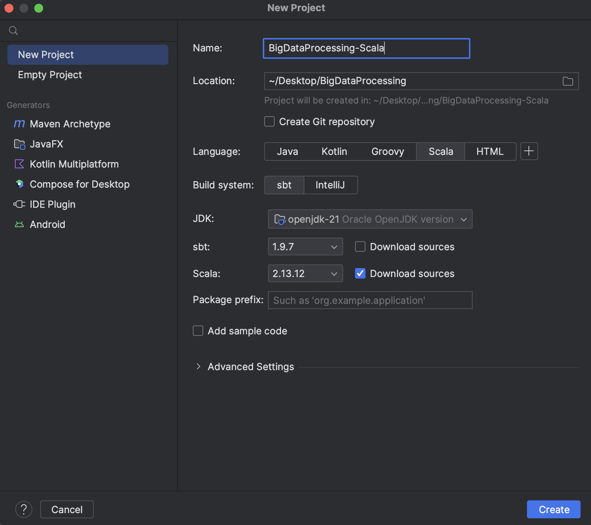
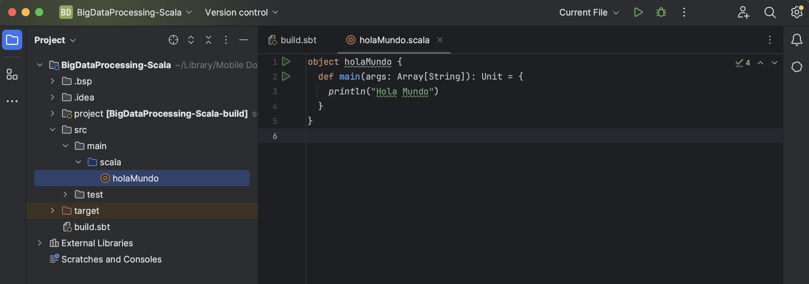

# Creación de un Proyecto Scala en IntelliJ

Si estás familiarizado con Java y has trabajado con IntelliJ, crear un proyecto Scala es bastante similar. Sigue estos pasos:

1. Abre IntelliJ IDEA y selecciona "File" (Archivo) en la parte superior izquierda.

2. Elige "New" (Nuevo) y selecciona "Project" (Proyecto).

3. Asegúrate de seleccionar "Scala" en la lista de tecnologías disponibles.



4. Configura el proyecto con un nombre y una ubicación.

5. IntelliJ generará una estructura de directorios estándar para tu proyecto Scala, que incluirá carpetas como "src" (fuente) y "out" (salida).



## Consola de Scala

Scala proporciona una consola interactiva que te permite ejecutar fragmentos de código Scala en tiempo real. Puedes acceder a la consola de Scala simplemente escribiendo `scala` en la línea de comandos.

## `var` vs. `val` en Scala

En Scala, puedes declarar variables usando `var` o `val`. La diferencia clave es que las variables declaradas con `val` son *inmutables*, lo que significa que no pueden cambiar una vez que se les asigna un valor, mientras que las variables declaradas con `var` pueden cambiar.

```scala
val nombre = "Juan"  // Una variable inmutable
var edad = 30        // Una variable mutable
```

## Listas en Scala

Scala ofrece una rica API para trabajar con listas. Puedes crear y manipular listas de manera eficiente. Aquí hay un ejemplo simple:

```scala
val numeros = List(1, 2, 3, 4, 5)
val numerosDobles = numeros.map(_ * 2)  // Duplicar cada número
```

## Ejemplos de Scala

A continuación, te proporcionamos un ejemplo de código Scala que muestra cómo definir una función y llamarla:

```scala
object EjemploScala {
  def saludar(nombre: String): String = {
    s"Hola, $nombre"
  }

  def main(args: Array[String]): Unit = {
    val mensaje = saludar("Juan")
    println(mensaje)
  }
}
```

Este programa define una función llamada `saludar` que toma un nombre como argumento y devuelve un saludo personalizado. Luego, en el método `main`, llamamos a esta función y mostramos el resultado en la consola.

**Scala** es un lenguaje poderoso que *combina las mejores características de la programación orientada a objetos y funcional*. A medida que te sumerges en Scala, descubrirás su elegancia y expresividad, lo que lo convierte en una herramienta valiosa para desarrolladores de todo tipo. ¡Explora y disfruta de la programación en Scala!