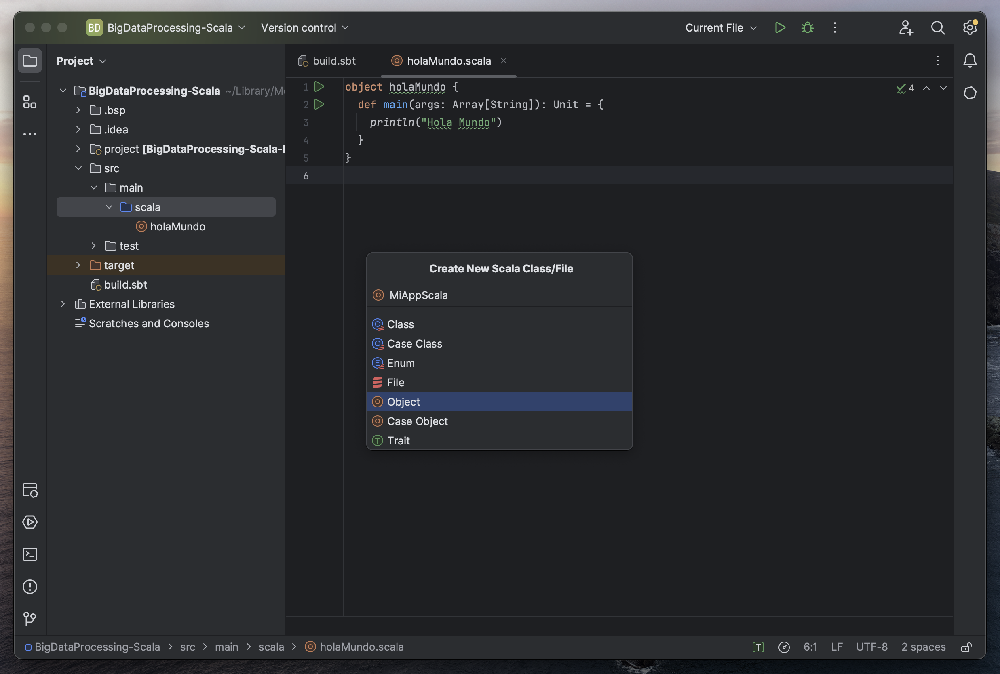

```
/* MiAppScala es una aplicación de ejemplo de Scala.
* Este programa imprimirá los resultados de cada ejemplo.
* Este es un ejemplo de comentario multi-linea
*/

object MiAppScala {
  def main(args: Array[String]): Unit = {
    // Este es el punto de entrada de la aplicación
    // Este también es un ejemplo de comentario de 1 línea

    // Declaración de variables
    val numeroEntero: Int = 42
    val texto: String = "Hola, Rocío!"

    // Imprimir en la consola
    println(texto)

    // Estructuras de control
    if (numeroEntero > 0) {
      println("El número es positivo.")
    } else if (numeroEntero < 0) {
      println("El número es negativo.")
    } else {
      println("El número es cero.")
    }

    // Bucles
    for (i <- 1 to 5) {
      println(s"Iteración $i")
    }

    // Funciones
    def suma(a: Int, b: Int): Int = {
      a + b
    }

    val resultado = suma(3, 5)
    println(s"La suma es: $resultado")
  }
}
```

**Consola:**

```
Hola, Rocío!
El número es positivo.
Iteración 1
Iteración 2
Iteración 3
Iteración 4
Iteración 5
La suma es: 8
```

## Cómo crear un objeto Scala en IntelliJ IDEA

Para crear un objeto Scala en IntelliJ IDEA, sigue estos pasos:

1. Abre IntelliJ IDEA: Inicia IntelliJ IDEA en tu computadora si no lo has hecho ya.

2. Crea un Nuevo Proyecto:
   - Ve al menú "File" (Archivo) en la parte superior izquierda.
   - Selecciona "New" (Nuevo) y luego "Project" (Proyecto).

3. Selecciona un Proyecto Scala:
   - En la ventana de creación de proyecto, selecciona "Scala" en la lista de tipos de proyectos disponibles.
   - Luego, selecciona "SBT" o "Mill" como sistema de construcción Scala, dependiendo de tus preferencias. SBT es el más comúnmente utilizado.

4. Configura el Proyecto:
   - Especifica la ubicación del proyecto y nómbralo según tu preferencia.
   - Asegúrate de seleccionar una versión de Scala (por ejemplo, Scala 2.12) para tu proyecto.
   - Haz clic en "Finish" (Finalizar) para crear el proyecto.

5. Crea un Objeto Scala:
   - En la ventana del proyecto de IntelliJ IDEA, expande la carpeta "src" para ver la carpeta "main".
   - Dentro de "main", encontrarás una carpeta llamada "scala". Haz clic derecho en "scala" y selecciona "New" (Nuevo) y luego "Scala Class" (Clase Scala).

6. Configura la Clase Scala:
   - En la ventana emergente "Create New Scala Class" (Crear nueva clase Scala), ingresa un nombre para tu objeto Scala en el campo "Name" (Nombre).
   - Asegúrate de que la opción "Object" (Objeto) esté seleccionada como "Kind" (Tipo).
   - Opcionalmente, puedes elegir una plantilla de código inicial si lo deseas.
   - Haz clic en "OK" para crear el objeto Scala.

7. Editar el Objeto Scala:
   - El objeto Scala recién creado se abrirá en el editor de código de IntelliJ IDEA. Puedes editar el código en este archivo para definir tu objeto Scala y su funcionalidad.

8. Ejecuta el Objeto Scala:
   - Puedes ejecutar el objeto Scala haciendo clic derecho en el código y seleccionando "Run" (Ejecutar). Esto ejecutará el objeto y mostrará la salida en la consola de IntelliJ IDEA.

Siguiendo estos pasos, habrás creado y ejecutado un objeto Scala en IntelliJ IDEA. Puedes continuar editando y desarrollando tu código Scala en este entorno de desarrollo integrado.

