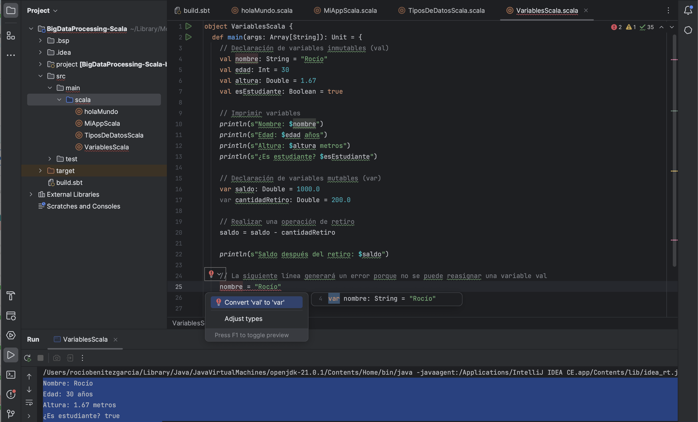

```
object VariablesScala {
  def main(args: Array[String]): Unit = {
    // Declaración de variables inmutables (val)
    val nombre: String = "Rocío"
    val edad: Int = 30
    val altura: Double = 1.67
    val esEstudiante: Boolean = true

    // Imprimir variables
    println(s"Nombre: $nombre")
    println(s"Edad: $edad años")
    println(s"Altura: $altura metros")
    println(s"¿Es estudiante? $esEstudiante")

    // Declaración de variables mutables (var)
    var saldo: Double = 1000.0
    var cantidadRetiro: Double = 200.0

    // Realizar una operación de retiro
    saldo = saldo - cantidadRetiro

    println(s"Saldo después del retiro: $saldo")

    // La siguiente línea generará un error porque no se puede reasignar una variable val
    // nombre = "Rocío"
  }
}
```

**Consola:**

```
Nombre: Rocío
Edad: 30 años
Altura: 1.67 metros
¿Es estudiante? true
Saldo después del retiro: 800.0
```

En este código, se declaran varias variables, algunas utilizando `val` (variables *inmutables*) y otras utilizando `var` (variables *mutables*).

Las variables declaradas con `val` *no pueden cambiar su valor una vez asignado*, lo que garantiza la **inmutabilidad**. Por ejemplo, nombre, edad, altura y esEstudiante son variables inmutables.

Las variables declaradas con `var` *pueden cambiar su valor* en cualquier momento, como se ilustra con saldo y cantidadRetiro. En este caso, se realiza una operación de retiro y se actualiza el valor de saldo.

La diferencia clave entre val y var es la inmutabilidad. Las variables val son inmutables, mientras que las variables var son mutables y pueden cambiar su valor.


