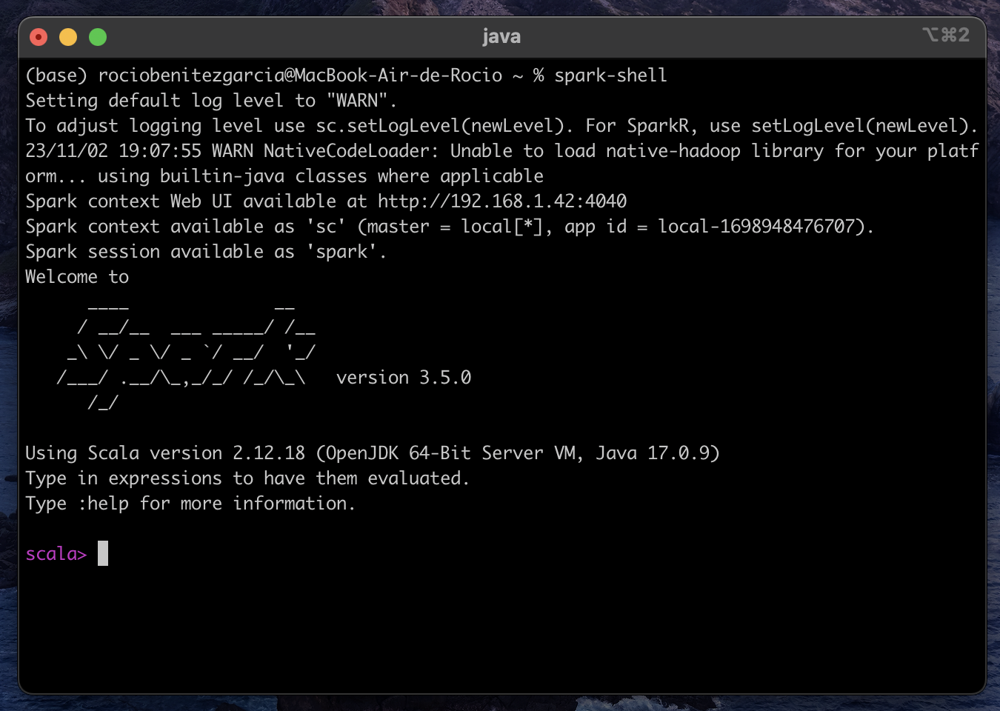

# Apache Spark

En el contexto de Apache Spark, RDD significa *"Resilient Distributed Dataset"* (Conjunto de Datos Distribuido Resistente). Los RDD son una abstracción fundamental y una estructura de datos central en Spark que representan *colecciones de datos distribuidos a lo largo de un clúster de máquinas*.


Aquí hay algunas características clave de los RDD en el contexto de Spark:

1. **Distribución y Tolerancia a Fallos**:
   - Los RDD se dividen en particiones, y estas particiones se distribuyen en múltiples nodos de un clúster de Spark. Esto permite el procesamiento paralelo de datos.
   - Los RDD son resistentes a fallos, lo que significa que si un nodo del clúster falla, los datos se pueden recuperar a partir de las particiones en otros nodos.

2. **Inmutabilidad**:
   - Los RDD son inmutables, lo que significa que no se pueden modificar una vez creados. Cualquier transformación aplicada a un RDD da como resultado un nuevo RDD en lugar de modificar el RDD original.

3. **Transformaciones y Acciones**:
   - Los RDD admiten operaciones de transformación y acciones. Las transformaciones son operaciones que crean un nuevo RDD a partir de un RDD existente (por ejemplo, `map`, `filter`, `reduceByKey`), mientras que las acciones son operaciones que devuelven resultados al programa principal (por ejemplo, `count`, `collect`, `saveAsTextFile`).

4. **Evaluación Perezosa (Lazy Evaluation)**:
   - Spark utiliza una evaluación perezosa, lo que significa que las transformaciones en un RDD no se ejecutan de inmediato. En cambio, Spark registra las transformaciones y las ejecuta solo cuando se solicita una acción.
   - Esto permite la optimización de las operaciones y la ejecución eficiente de tareas.

5. **Tipado de Datos Fuerte**:
   - Los RDD tienen un tipo de dato fuerte, lo que significa que los elementos dentro de un RDD deben ser del mismo tipo de datos.

6. **Paralelismo y Escalabilidad**:
   - Los RDD permiten el procesamiento paralelo distribuyendo los datos en particiones y permitiendo que las tareas se ejecuten en paralelo en varios nodos. Esto proporciona escalabilidad para manejar grandes volúmenes de datos.

7. **Soporte para Diversas Fuentes de Datos**:
   - Los RDD pueden representar datos que provienen de diversas fuentes, como sistemas de archivos locales, HDFS, bases de datos y más. Esto permite la integración con diversas fuentes de datos.

Los RDD son una parte fundamental de Spark y se utilizan para representar y manipular datos en un entorno distribuido. Permiten el procesamiento de datos a gran escala y la construcción de aplicaciones de análisis de datos, aprendizaje automático y más en clústeres de servidores.

## Pasos para instalar Apache Spark en MacOS

- Paso 1: Instalar Homebrew
- Paso 2: Instalar Java
- Paso 3: Instalar Scala
- Paso 4: Instalar la última versión de Apache Spark
- Paso 5: Iniciar Spark Shell y validar la instalación 

### Instalación de Homebrew

Homebrew es un administrador de paquetes muy útil para macOS que te permite instalar fácilmente paquetes de terceros, como Java y Apache Spark, en tu sistema Mac (macOS). Para comenzar a utilizar Homebrew, primero debes instalarlo siguiendo estos pasos:

**Paso 1: Instalar Homebrew**

Abre tu terminal y ejecuta el siguiente comando. Este comando descargará e instalará Homebrew en tu sistema.

```bash
/bin/bash -c "$(curl -fsSL https://raw.githubusercontent.com/Homebrew/install/HEAD/install.sh)"
```

Nota: Durante la instalación, es posible que se te solicite ingresar la contraseña de administrador (root). Debes proporcionar la contraseña para continuar con la instalación.

**Paso 2: Configurar Homebrew en tu $PATH**

Una vez que Homebrew esté instalado, es necesario configurar tu entorno para que pueda encontrar y utilizar los paquetes instalados por Homebrew. Esto se logra añadiendo la ruta de Homebrew a tu variable de entorno $PATH. Ejecuta los siguientes comandos en tu terminal:

```bash
echo 'eval "$(/opt/homebrew/bin/brew shellenv)"' >> ~/.zprofile
eval "$(/opt/homebrew/bin/brew shellenv)"
```

Esto asegura que tu sistema reconozca los paquetes instalados por Homebrew.

**Paso 3: Verificar la instalación**

Para confirmar que Homebrew se ha instalado correctamente en tu sistema, puedes ejecutar el siguiente comando en tu terminal:

```bash
brew --version
```

Si la instalación fue exitosa, este comando mostrará la versión de Homebrew.

Alternativamente, puedes visitar el [sitio web oficial de Homebrew](https://brew.sh/) y seguir las instrucciones de instalación proporcionadas en su página principal.

Con Homebrew instalado y configurado en tu sistema, estarás listo para gestionar fácilmente paquetes y software en tu Mac.

### Instalación de Java (OpenJDK)

Para ejecutar Apache Spark, es esencial tener Java instalado en tu sistema, ya que Spark se basa en Java. Puedes instalar Java fácilmente en tu Mac utilizando Homebrew. A continuación, se muestra cómo instalar OpenJDK versión 17 con Homebrew:

**Paso 1: Instalar OpenJDK 17**

Abre tu terminal y ejecuta el siguiente comando para instalar OpenJDK 17:

```bash
brew install openjdk@17
```

Este comando utilizará Homebrew para descargar e instalar OpenJDK 17 en tu sistema.

### Instalación de Scala (Opcional)

Scala es un lenguaje de programación utilizado en el desarrollo de Apache Spark, aunque no es necesario instalar Scala directamente, ya que Spark puede utilizar las dependencias de Scala desde Maven o sbt. Sin embargo, si deseas instalar Scala por separado, puedes hacerlo con Homebrew.

**Paso 2: Instalar Scala (Opcional)**

Si deseas instalar Scala en tu sistema, puedes ejecutar el siguiente comando:

```bash
brew install scala
```

Esto instalará Scala en tu Mac.

### Instalación de Apache Spark en macOS

Para comenzar a trabajar con Apache Spark en macOS, puedes instalar la última versión de Apache Spark en tu sistema utilizando Homebrew. A continuación, se indican los pasos para llevar a cabo la instalación:

**Paso 1: Instalar Apache Spark**

Abre tu terminal y ejecuta el siguiente comando para instalar la última versión de Apache Spark en tu Mac:

```bash
brew install apache-spark
```

Este comando utilizará Homebrew para descargar e instalar Apache Spark en tu sistema. Dependiendo de tu versión de Homebrew y sistema operativo, Apache Spark se instalará en una ubicación predeterminada, que es la siguiente:

```
/opt/homebrew/Cellar/apache-spark/
```

**Paso 2: Iniciar Spark-Shell**

Después de una instalación exitosa de Apache Spark, puedes ejecutar el Spark-Shell desde la línea de comandos para iniciar el Spark Shell. Deberías ver una salida similar a la siguiente (ignora cualquier advertencia por ahora). Spark-Shell es una utilidad de línea de comandos que se incluye en la distribución de Apache Spark.



**Paso 3: Validar la instalación de Spark desde el Shell**

Para validar la instalación, puedes crear un DataFrame de Spark con algunos datos de muestra. Ingresa los siguientes comandos en el Spark Shell en el mismo orden:

```scala
import spark.implicits._
val data = Seq(("Java", "20000"), ("Python", "100000"), ("Scala", "3000"))
val df = data.toDF()
df.show()
```

Estos comandos crearán un DataFrame y mostrarán los datos en el Spark Shell. Si ves los datos correctamente, eso significa que la instalación de Apache Spark ha sido exitosa.


Ten en cuenta que los detalles de la instalación y la ubicación de los archivos pueden variar según la versión de Homebrew y tu configuración específica. Asegúrate de que Apache Spark se haya instalado en tu sistema y estés listo para comenzar a trabajar con Spark en macOS.