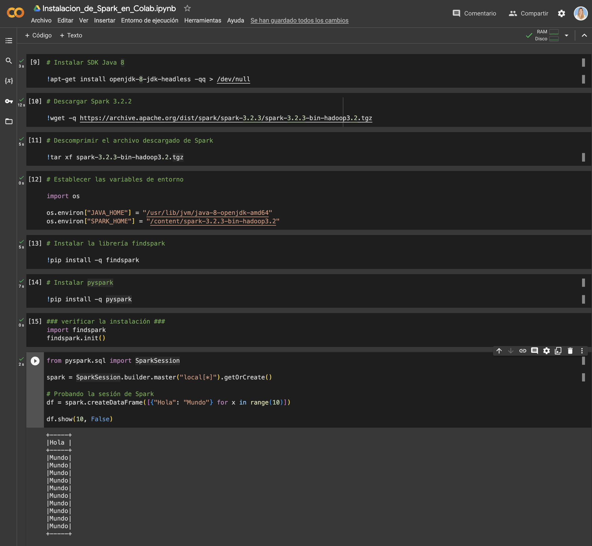

# Instalar Apache Spark en Google Colab

Este tutorial te guiará a través del proceso de instalación de Apache Spark en Google Colab, lo que te permitirá aprovechar las capacidades de Spark para el procesamiento de datos distribuidos en tu entorno de Google Colab.

**Nota:** Puedes seguir los pasos a continuación o hacer clic en el siguiente enlace para acceder al archivo de Google Colab con los pasos de instalación: [Instalar Apache Spark en Google Colab (Colab Notebook)](/Main-insights-and-learnings/7-Spark/1-Spark-Colab-Instalacion.ipynb).

## Paso 1: Instalar SDK Java 8

Primero, debes instalar el Kit de Desarrollo de Java (JDK) versión 8. Puedes hacerlo ejecutando el siguiente comando en una celda de Colab:

```python
!apt-get install openjdk-8-jdk-headless -qq > /dev/null
```

## Paso 2: Descargar Apache Spark

A continuación, descargaremos la versión de Apache Spark que queremos instalar. En este ejemplo, descargaremos Apache Spark 3.2.3, pero puedes ajustar la versión según tus necesidades. Ejecuta el siguiente comando para descargar Apache Spark:

```python
!wget -q https://archive.apache.org/dist/spark/spark-3.2.3/spark-3.2.3-bin-hadoop3.2.tgz
```

## Paso 3: Descomprimir Apache Spark

Una vez que se complete la descarga, descomprimiremos el archivo descargado de Apache Spark con el siguiente comando:

```python
!tar xf spark-3.2.3-bin-hadoop3.2.tgz
```

## Paso 4: Establecer las Variables de Entorno

Ahora, configuraremos las variables de entorno para que Colab pueda encontrar Java y Apache Spark. Ejecuta el siguiente código para establecer las variables de entorno:

```python
import os

os.environ["JAVA_HOME"] = "/usr/lib/jvm/java-8-openjdk-amd64"
os.environ["SPARK_HOME"] = "/content/spark-3.2.3-bin-hadoop3.2"
```

## Paso 5: Instalar la Biblioteca `findspark`

Para facilitar la inicialización de Spark en Colab, instalaremos la biblioteca `findspark` con el siguiente comando:

```python
!pip install -q findspark
```

## Paso 6: Verificar la Instalación

Para verificar que Spark se ha instalado correctamente, puedes ejecutar el siguiente código que inicializa una sesión de Spark y muestra un DataFrame de ejemplo:

```python
import findspark
findspark.init()
from pyspark.sql import SparkSession

spark = SparkSession.builder.master("local[*]").getOrCreate()

# Probando la sesión de Spark
df = spark.createDataFrame([{"Hola": "Mundo"} for x in range(10)])

df.show(10, False)
```

¡Eso es todo! Ahora tienes Apache Spark instalado en tu entorno de Google Colab y estás listo para comenzar a trabajar con grandes conjuntos de datos y realizar análisis de datos distribuidos.
```

Solo copia y pega este contenido en un archivo Markdown o directamente en una celda de Google Colab para ejecutar los pasos de instalación.


